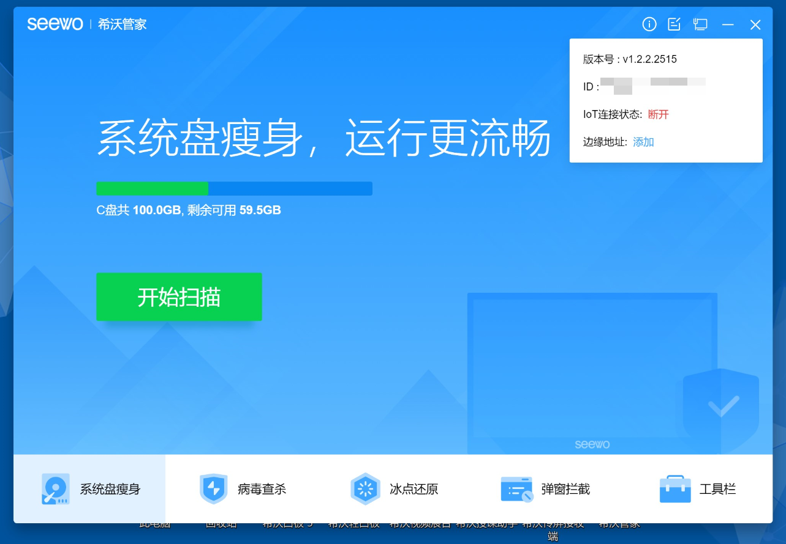
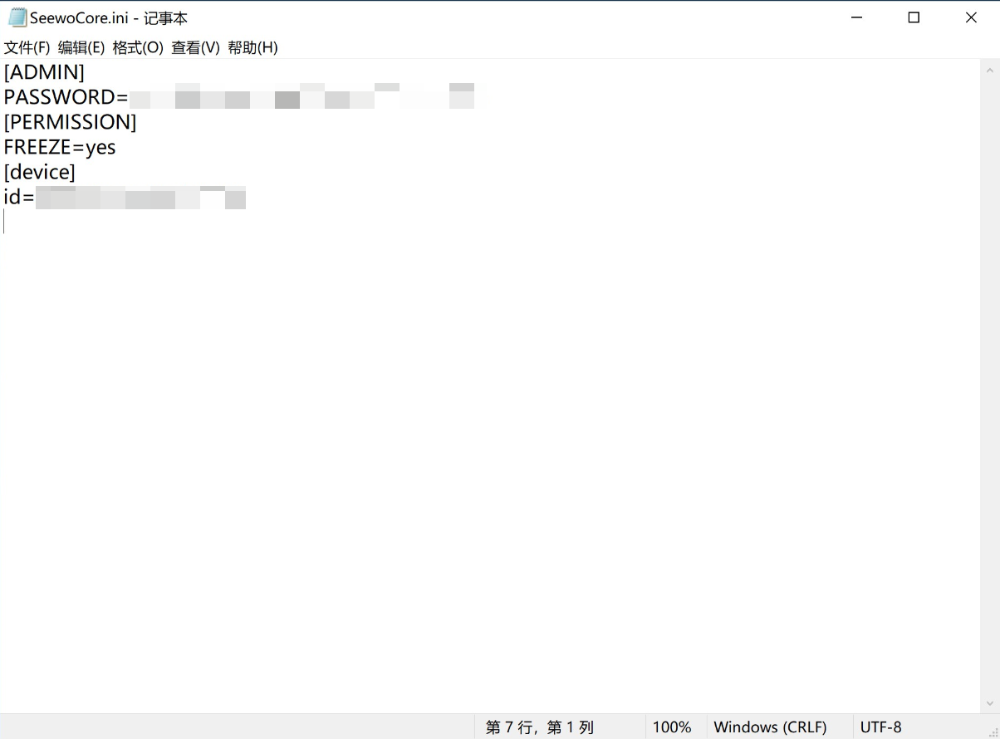

# SeewoServiceAssitant - 希沃管家

> 希沃管家是希沃自研的系统管理软件。可对交互智能平板实现系统还原、弹窗拦截等操作，在保护设备系统安全的同时，给学校提供一个纯净、无扰的课堂教学环境。
>
> *以上摘自[希沃官网](https://www.seewo.com/index.php/Product/soft/cat_id/129/nid/304)*



*由于我使用火绒阻止了希沃的各类服务连接网络，故此处的连接状态是断开的*

## 程序主体

### 配置文件

通过在系统文件中翻找，我们不难在 ```C:\ProgramData\Seewo\SeewoCore``` 中找到 ```SeewoCore.ini```



这是希沃管家的配置文件，里面包含希沃管家的密码(6位数字 使用MD5加密存储在这里)，是否开启希沃冰点还原，~~希沃的~~设备id  
~~不知道还会不会记录其他信息~~

因此，有巨佬 ~~*ezrameow*~~ 看见这个配置文档后，编写了 [SeewoAssistantPasswordRecovery - ezrameow](https://github.com/ezrameow/SeewoAssistantPasswordRecovery) ，通过枚举来暴力破解希沃管家的管理员密码
